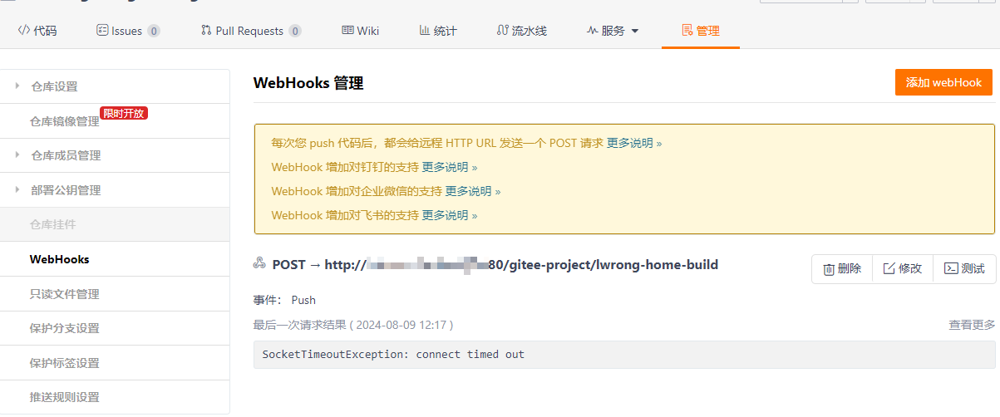

# 关于本博客的创建

[[toc]]

## 创建VitePress项目

参考 [vitepress快速搭建](https://vitepress.dev/zh/guide/getting-started)

`VitePress`可以基于已有的npm项目搭建：

### 如果还没有npm项目，先创建项目

::: code-group
```sh [npm]
$ cd projectname
$ npm init
```
:::

### 在创建好的npm项目根目录，添加`vitepress`开发依赖

::: code-group

```sh [npm]
$ npm add -D vitepress
```

```sh [pnpm]
$ pnpm add -D vitepress
```

```sh [yarn]
$ yarn add -D vitepress
```

```sh [yarn (pnp)]
$ yarn add -D vitepress vue
```

```sh [bun]
$ bun add -D vitepress
```

:::

### 使用vitepress命令初始化项目

然后，使用`vitepress`命令，把本项目初始化为包含vitepress文档的项目

::: code-group

```sh [npm]
$ npx vitepress init
```

```sh [pnpm]
$ pnpm vitepress init
```

```sh [yarn]
$ yarn vitepress init
```

```sh [bun]
$ bun vitepress init
```

:::

执行`vitepress init`需要选择vitepress配置文件位置，输入`./docs`，整合`vitepress`之后项目目录结构如下：

```
.
├─ docs
│  ├─ .vitepress
│  │  └─ config.mjs
│  └─ index.md
└─ package.json
```

:::tip
默认情况下，VitePress 将其开发服务器缓存存储在 `.vitepress/cache` 中，并将生产构建输出存储在 `.vitepress/dist` 中。

初始化时会自动将它们添加到 `.gitignore` 文件中。

:::

```.gitignore
docs/.vitepress/cache
docs/.vitepress/dist
```


> 至此，已经在项目中整合了`vitepress`文档功能，使用其默认配置和默认格式化样式！


### 手动配置vitepress博客的左侧导航菜单

`docs/.vitepress/config.js`：

```js
import { defineConfig } from 'vitepress'

export default defineConfig({
  title: "",
  description: "",
  themeConfig: {

    sidebar: [
      {
        text: '自动化',
        items: [
          { text: '关于本博客的创建', link: '/autoDeploy/about' }
        ]
      }
    ],
  }
})

```

当然，也可以把`sidebar`抽出成一个独立的js：

```js
import { defineConfig } from 'vitepress'
import sidebar from './sidebar.js'

export default defineConfig({
  title: "Lwrong网站博客",
  description: "关于Lwrong网站的故事...",
  themeConfig: {

    sidebar: sidebar,
  }
})

```

到此，就可以不断的往博客里面添加文章和导航菜单了。

::: tip

更多配置可参考 [官方指导：站点配置](https://vitepress.dev/zh/reference/site-config)

或者参考其他vitepress项目

比如：[learning-vue3/.vitepress/config.ts](https://github.com/chengpeiquan/learning-vue3/blob/main/.vitepress/config.ts)

:::


### 本地测试

在  [使用vitepress命令初始化项目](#使用vitepress命令初始化项目) 的时候已经把 npm 脚本注入到 `package.json` 中：

```json
{
  "scripts": {
    "docs:dev": "vitepress dev docs",
    "docs:build": "vitepress build docs",
    "docs:preview": "vitepress preview docs"
  },
}
```

写好markdown之后，执行`npm run docs:dev`

点击链接即可查看效果！

## 发布vitepress博客

### 一、手动copy（不推荐）

执行`npm run docs:build`

把`docs/.vitepress/dist`目录下的文件上传至服务器，使用nginx或者GitHub Page访问。

### 二、使用Jenkins自动部署

#### 方式一

本地打包，push到git服务器，通过Jenkins的钩子自动部署到nginx



1. 在Jenkins中配置每当push自动拉取代码（打包好的代码）
2. 把代码复制到指定目录（发布）：
```bash
zip -r /opt/web/lwrong-home.zip /opt/web/lwrong-home

rm -rf /opt/web/lwrong-home/*

cp -r ./* /opt/web/lwrong-home/
```

#### 方式二

1. 在Jenkins中配置每当push自动拉取代码（源码）
2. 在Jenkins中配置，把源码打包
```
pnpm install
pnpm run build
```
3. 把代码复制到指定目录（发布）

### 三、使用GitHub Action自动发布博客

请查看下一章：[使用GitHub Action发布博客](./deploy-by-github-action)
