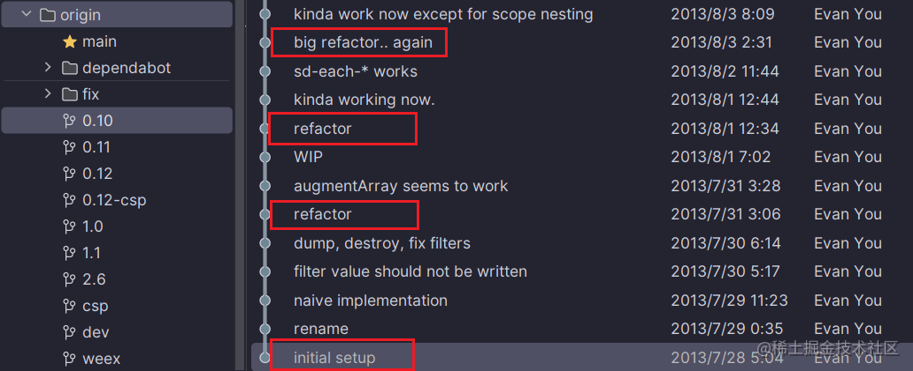
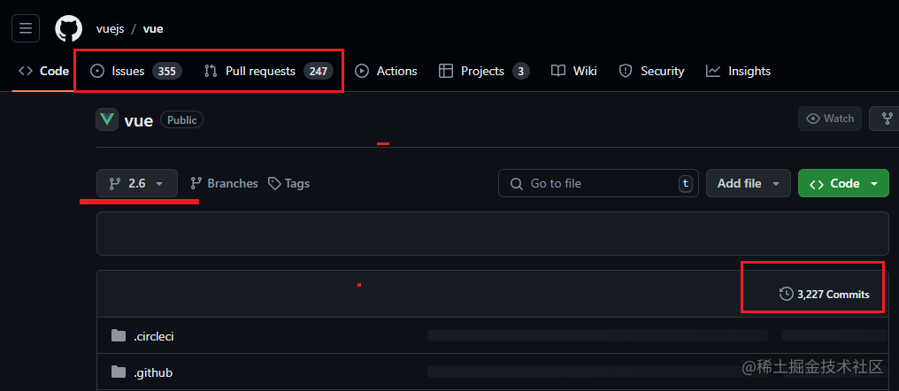
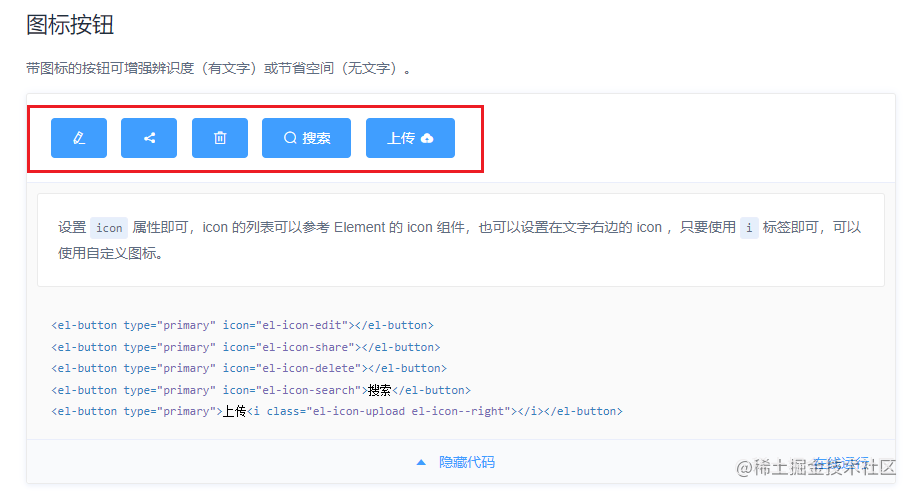

## 缘由

过去我从事了5年的后端开发工作，因为由于一些无可避免的变故本人gap（待业）了很长一段时间，再次重拾捡起过往的技术知识时发现：
1. 学过的知识点虽然并未遗忘，但是需要费力重新去思考回忆
2. 在写新项目时并未享受到过往积累的技术成果，很多技术无法复制、复用，再次重写一样的代码浪费时间
3. 曾经做的项目没有痕迹，无法系统的直白地给自己或者给别人展示过往的技术经验积累
4. 走一步没有留一个脚印，每次都要从头开始，没有时间和精力。本应站在过往成果巨人的肩膀上

可总结为：**知识易遗忘，技术难复用，过往无痕迹**

## VUE是怎么做的
对比自己的这个问题，我接触到一款前端开源框架（`VUE`），看看它从无到有的发展历程中，是如何一步步螺旋式构建起自己的生态的：

2013年vue作者在使用其他js框架（库）完成手头的工作时，感觉并没有那么顺畅和趁手，于是便有了按自己想法捣鼓一个新的实现方案的想法。

从上图可以看出，vue从一开始就是一个不断重构改进的过程。

从上图可以看出，vue通过github等各个生态记录了一路过来的commit、issues和pull requests，它的产生和发展过程得到了很好的记录，并且整个过程能够相当完整的展示出来，能够被生态圈看见以及参与。

vue从2015年v0.12版本发布就配套发布了自己的指引文档，相对直白深入的讲解了其思想原理，并且附带代码演示。

## 个人的初步想法

把过往知识具象化和图谱化，自认为，最大的**好处**在于，可以全局看清自己具备一个什么样的技术方面的知识体系，让这个体系成为一个随时看的见、用的上的垫脚石，第一个点是可以为日后重复的需求提供快捷模板，第二个点的意义在于，当我想要去实现一些创新性的应用（比如信息收集、个人手机APP定制化、利用互联网助益生活方式等等）时，**可以没有负担的直接从这个具象化的知识图谱的基础上开始新的“创作”**。

#### 网站的基本呈现思路：

不只是使用学过的技术，以及编写这些技术的代码，重点在于配套的说明文档，和，如何把看不见的技术呈现在网页上。

比如前端UI框架的技术逻辑如何呈现出来呢？下面是elementUI的“按钮”的代码示例（除了代码展示，还有在线调试工具，能够直观的感受底层代码与UI组件的关系）：

那么，对于后端代码，如何在网页上把底层代码逻辑和功能实现相联系起来呢？文档式的呈现就是文字加图表的说明方式，比如微服务的部署架构通过图表（来源于网络）来说明：

更深层次的方式就是通过网页交互的方式来呈现，这个对于前端UI来说可以直接使用视觉表达。

但是对于后端，比如获取和断开数据库的连接，如何直观的在网页上交互式表达出来，还需斟酌。

比如:

> 后端使用Java处理了一段业务逻辑，缓存数据到消息队列，并从数据库查询数据展现在前端视图中

对于这样一段后端代码，可能就需要监控消息队列和数据库的数据（展示出来），这是把数据流过程呈现在网页上。

对于底层代码逻辑，可能要通过代码块的方式直接写在网页上，来说明。这方面的思考等到后面再进一步讨论。

#### 架设这样一个网站所涵盖的工作内容：

- 基于网站设想的产品设计和设计方案的版本记录
- 编写所有涉及技术的源码并提交成记录
- 运行代码的服务器、数据库等线上资源的部署图谱
- 还要进行项目管理（时间分配），以及制定上线计划（版本迭代）

## 价值评估、现实考虑

该网站的建立并非一蹴而就，根据以上的初步预想，需要可能一年的空余时间的持续开发，能否真正的完成需要综合个人的时间、精力、经济、专注点和毅力等各方面现实因素。

#### 价值

对于我而言，并不想让技术占用过多的个人生活方面的时间。

工作很重要，付出的是给企业给社会创造真正的价值，获得的是真金白银的报酬。

个人生活也很重要，陪伴家人、朋友，抒发自己的情感，体验更大的世界。

技术爱好，如锦上添花，丰富自己的工作生活。

#### 现实

一步一个脚印，现实不是一帆风顺的，即使断断续续，只要有记录，在有时间的时候，就能马上捡起来，继续下去。

所以，先开始再说。

Just Do It！

